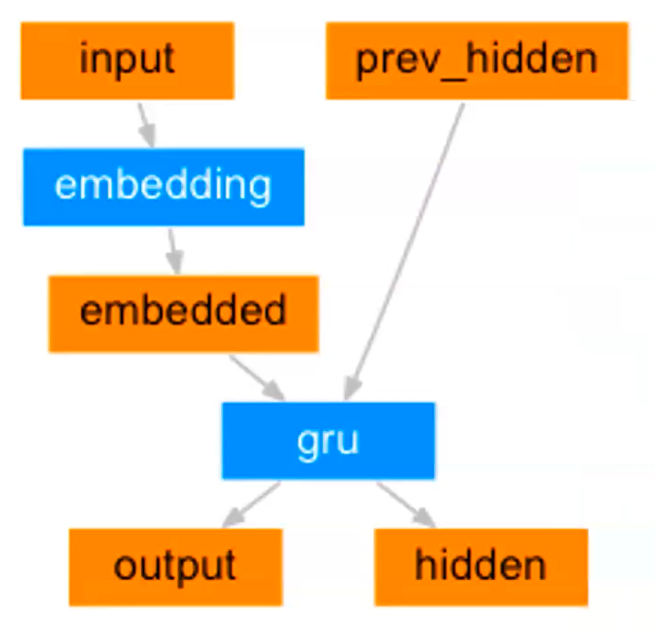
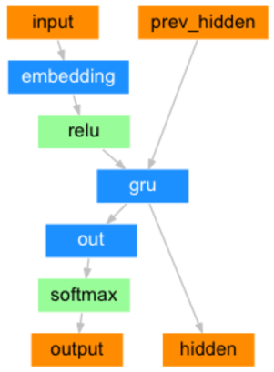
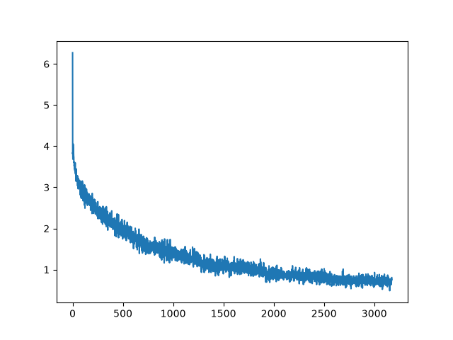
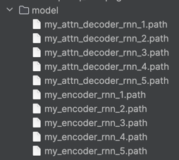
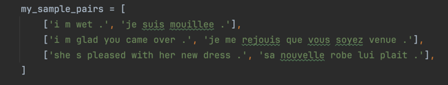
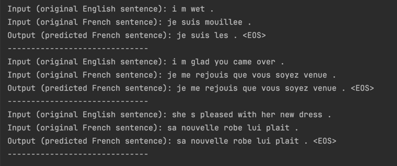
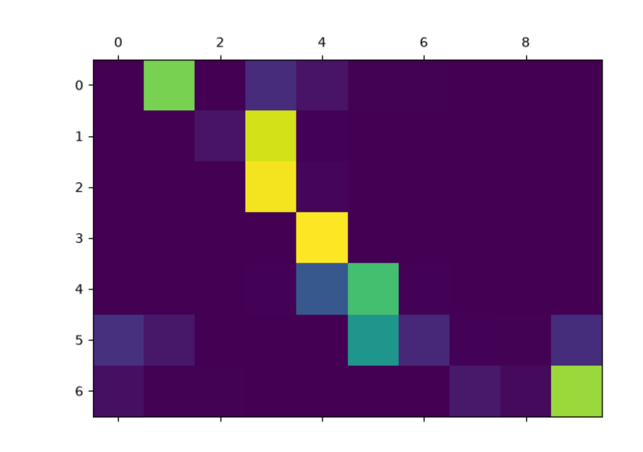

# Machine Translation with a Seq2Seq Model

## Project Context

Demonstrate the **Seq2Seq (Sequence-to-Sequence) architecture**, specifically the **RNN N-to-M model**, and show how it can be applied to a machine translation task using an **English-to-French translation example**.

---

## Translation Process Using a GRU-Based Seq2Seq Architecture

### 1. Import Libraries and Utilities

Import the required libraries, frameworks, and supporting utilities needed for data processing, model development, training, and evaluation.

### 2. Data Preprocessing

Process the dataset stored in persistent files so that it meets the requirements of the model training pipeline.

This includes:

- Loading the dataset
- Cleaning and normalising the text
- Tokenising sentences
- Building the vocabulary
- Converting tokens into numerical representations
- Preparing training and evaluation datasets
- Creating batches and padding sequences where required

### 3. Build the GRU-Based Seq2Seq Model

Implement a **Seq2Seq architecture based on GRU**, including:

- **Encoder**

- **Decoder without Attention**



- **Decoder with Attention**



The goal is to understand the difference between a standard Seq2Seq architecture and an Attention-based architecture, and how Attention improves the decoder's ability to focus on relevant parts of the input sequence.

### 4. Model Training

Train the Seq2Seq model using the prepared English-to-French dataset.

The training process should cover:

- Forward propagation
- Loss calculation
- Backpropagation
- Optimiser updates
- Teacher forcing
- Training and validation loss monitoring

### 5. Test train_seq2seq function:
After training for 3,000 samples per epoch, we can visualize the training loss curve:



- The loss curve is automatically saved to `./img/seq2seq_loss.png`.

Trained data suto-stored into model folder:



### 6. Model Evaluation

Evaluate the trained model using unseen data.

The evaluation should demonstrate:

- Generating French translations from English input sentences
- Comparing predicted translations with the expected translations
- Measuring model performance using appropriate evaluation metrics

### 8. call dm_test_seq2seq_evaluate and pass sample data to compare the model:





### 6. Additional: Attention Weight Visualisation

Visualise the attention matrix to demonstrate how the decoder dynamically focuses on different encoder hidden states when generating each target token.

This helps illustrate how the Attention mechanism learns source-target alignment during translation.


---

# Extension: Running PyTorch on a GPU

## 1. Platform Support

PyTorch GPU acceleration can be configured on:

- Windows
- Linux
- macOS

However, **CUDA requires an NVIDIA GPU**.

Therefore:

- Windows machines without a dedicated NVIDIA GPU cannot use CUDA.
- Intel-based Macs cannot use NVIDIA CUDA.
- Apple Silicon Macs can use Apple's **MPS backend** instead of CUDA.

---

## 2. Check the GPU / CUDA Version

### Windows / Linux — NVIDIA GPU

On a machine with an NVIDIA GPU, open a terminal or Command Prompt and run:

```bash
nvidia-smi
```

### macOS — Apple Silicon (M1/M2/M3/M4/M5)
```bash
system_profiler SPDisplaysDataType
```

To check the Mac GPU, open Terminal and run:
```python
import torch

print("MPS built:", torch.backends.mps.is_built())
print("MPS available:", torch.backends.mps.is_available())
```


